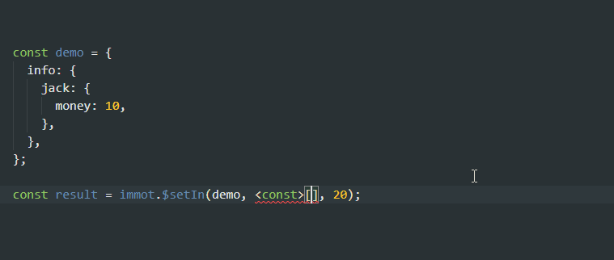
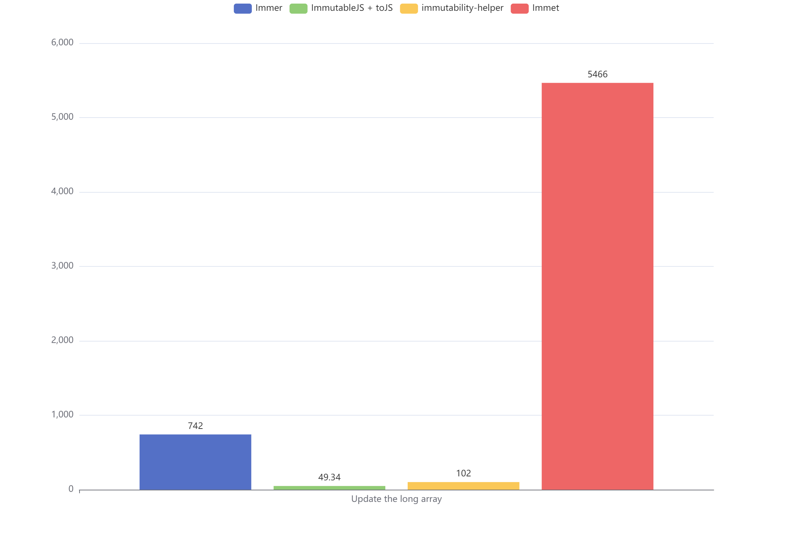

# immot

[![NPM version][npm-image]][npm-url]
[![Build status][build-image]][build-url]
[![Test coverage][coveralls-image]][coveralls-url]
[![Downloads][downloads-image]][downloads-url]
[![Minified size][min-size-image]][bundlephobia-url]
[![Gzip size][gzip-size-image]][bundlephobia-url]

在不改变原始数据的情况下，创建新的拷贝。

## 安装

```bash
pnpm i immot
```

或者

```bash
yarn add immot
```

## 介绍

`不可变数据` 是函数式编程中极其重要的一个基本概念。`React` 的 `state` 设计为只读，即 `不可变数据`，只能通过 `setState` 修改。此模块可以完美配合 `React`，以简化 `setState` 操作不可变数据的繁琐步骤。

在 `React` 中，你不能这样做：

```ts
state.a.b.c = 1;
// or...
state.c.d.f.push(2);
```

通常，你会这样做：

```ts
const nextState = {
  ...state,
  a: {
    ...state.a,
    b: {
      ...state.a.b,
      c: 1,
    },
  },
};
```

现在有了 `immot`，让操作深层数据变得简单：

```ts
const nextState = $setIn(state, ['a', 'b', 'c'], 1);

nextState === state;
// false
```

注意 **`immot` 不是深拷贝**，深拷贝操作极其昂贵，无法适用于日常开发。`immot` 只会创建改变的数据，会引用原对象中未改变的部分。

`immot` 的 API 灵感来自于 `immutable-js`，但 `immutable-js` 有独立的结构模型，复杂度高。`immot` 的设计理念是要求简单、易用，不需要过多的心智负担。因此在设计之初就亲和原生的 `JSON` 结构，只提供辅助函数，大小 < 1KB，就做到像 `immutable-js` 一样的效果。

`immot` 做到了 `typescript` 类型安全。`$updateIn`、`$setIn`、`$mergeIn` 中的 `keyPath` 路径支持类型自动提示（目前只支持小于 7 层结构）。



## 使用

```ts
import * as immot from 'immot';
```

或者只导入其中某个函数

```ts
import { $updateIn } from 'immot';
```

`immot` 所有函数操作都会返回一个新的对象。

### $set

用于设置 `对象/数组/Map` 中的属性值。`keyPath` 为字符串。

```ts
const result = immot.$set(demo, 'a', 1);
```

### $setIn

用于设置 `对象/数组/Map` 中的属性值。它可以为深层对象做操作，`keyPath` 为路径数组

```ts
const result = immot.$setIn(demo, ['a', 'b', 1, 'c'], 'good');
```

### $merge

用于合并 `对象/数组` 中的属性列表。

```ts
const result = immot.$merge(demo, { tom: 1, jack: 2 });

const result1 = immot.$merge(demo1, [5, 6]);
```

### $mergeIn

用于合并 `对象/数组` 中的属性列表。它可以为深层对象做操作，`keyPath` 为路径数组

```ts
const result = immot.$mergeIn(demo, ['a', 1, 'b'], { tom: 1, jack: 2 });
```

### $update

通过回调函数设置 `对象/数组/Map` 中的属性值。`keyPath` 为字符串。

```ts
const result = immot.$update(demo, 'money', (prev) => prev + 1);
```

### $updateIn

通过回调函数设置 `对象/数组/Map` 中的属性值。它可以为深层对象做操作，`keyPath` 为路径数组

```ts
const result = immot.$updateIn(demo, ['todoList', 0, 'complete'], (complete) => !complete);
```

### $delete

用于删除 `对象/数组/Map` 中的可选属性值，`keyPath` 为字符串或者数组

```ts
const result = immot.$delete(demo, 'a1');
const result1 = immot.$delete(demo, ['a1', 'a2']);
```

### $push

类似 `Array.prototype.push`，但返回新数组

```ts
const result = immot.$push(demo, 4);
```

### $pop

类似 `Array.prototype.pop`，但返回新数组

```ts
const result = immot.$pop(demo);
```

### $shift

类似 `Array.prototype.shift`，但返回新数组

```ts
const result = immot.$shift(demo);
```

### $unshift

类似 `Array.prototype.unshift`，但返回新数组

```ts
const result = immot.$unshift(demo, 4);
```

### $splice

类似 `Array.prototype.splice`，但返回新数组

```ts
const result = immot.$splice(demo, 1, 0, 'test');
```

### 性能测试

在 `/bench` 目录中有性能测试对比的样例，可以 clone 本项目测试

```bash
cd bench
pnpm i
node index.mjs
```

注意：

1. 数值为每秒操作数量，越高越好
2. 样例中 `immer` 关闭了自动冻结对象的特性，否则结果会更差。
3. 数组性能测试图中隐藏了 `immutableJS` 数据，用空间换取时间的方式导致数值太高，影响对比。

在 Node v14.17.0 的测试结果：

常规数据和深层数据


50000 长度的数组


[npm-image]: https://img.shields.io/npm/v/immot.svg?style=flat-square
[npm-url]: https://npmjs.org/package/immot
[build-image]: https://github.com/MinJieLiu/immot/actions/workflows/node.js.yml/badge.svg
[build-url]: https://github.com/MinJieLiu/immot/actions
[coveralls-image]: https://img.shields.io/coveralls/MinJieLiu/immot.svg?style=flat-square
[coveralls-url]: https://coveralls.io/r/MinJieLiu/immot
[downloads-image]: http://img.shields.io/npm/dm/immot.svg?style=flat-square
[downloads-url]: https://npmjs.org/package/immot
[min-size-image]: https://badgen.net/bundlephobia/min/immot?label=minified
[gzip-size-image]: https://badgen.net/bundlephobia/minzip/immot?label=gzip
[bundlephobia-url]: https://bundlephobia.com/result?p=immot
